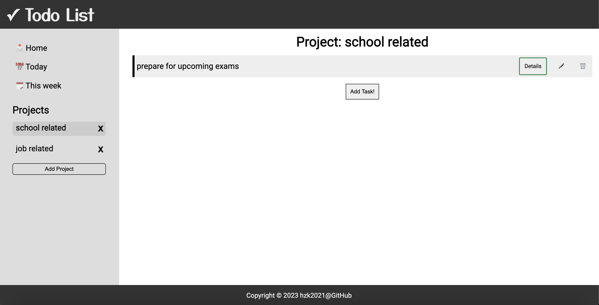

# Todo-List

This is a responsive todo list app that helps keep track of tasks with custom project folders.

## [Live Demo](https://hzk2021.github.io/Todo-List/)

### Features

- Save todo items to default folders (Home, Today, Week) or create a custom project folder and store them there.
- View todo details, edit and delete items.
- Data saved in localStorage.
- Web and mobile responsive.

### Features to implement/add-on
- Complete item details and edit theming, as it currently stands, the buttons are prompting a popup that asks for user input.
- Login page for different users (database support)

#### Languages Used

  &emsp;   &emsp;   &emsp;  
